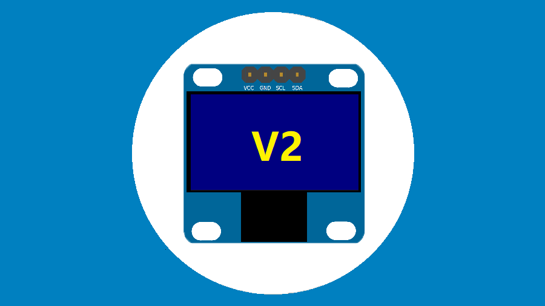
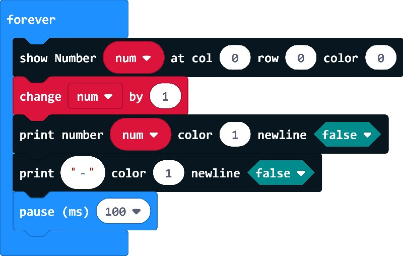

# I2C OLED 128x64 PXT extension

makecode I2C OLED 128x64 extension V2 for micro:bit. with 6x8 font, and increased display speed.  

Part of the drive base on fizban99's microbit OLED driver:  
https://github.com/fizban99/microbit_ssd1306  

Author: shaoziyang  
Date:   2019.Jul  

  

## Demo

```
let X = 0
basic.forever(function () {
    OLED12864_I2C.printNumber(X, 1, false)
    OLED12864_I2C.printString(", ", 1, false)
    basic.pause(500)
})
```



## License

MIT

Copyright (c) 2019, microbit/micropython Chinese community    

## Supported targets

* for PXT/microbit

